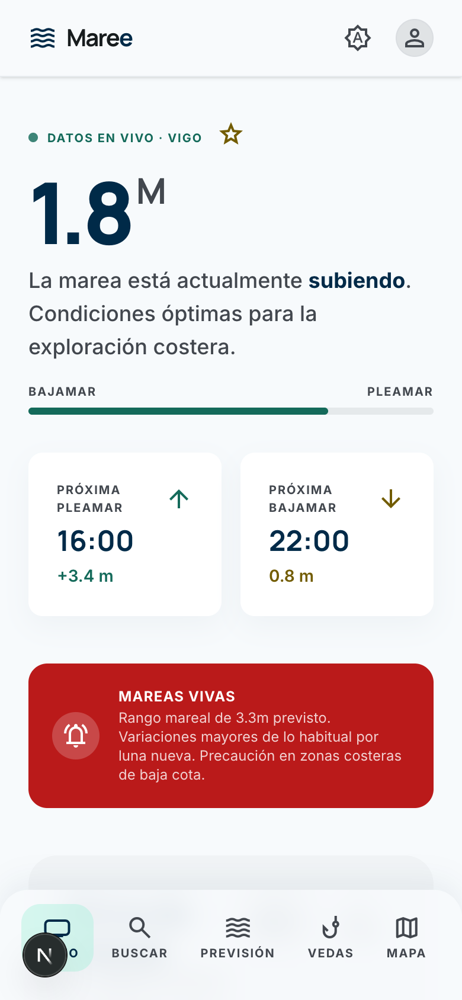
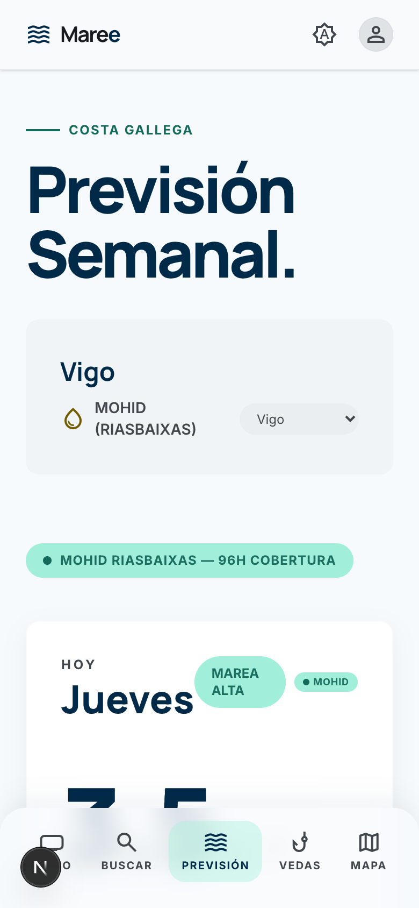
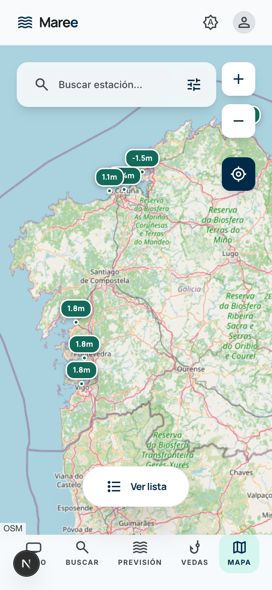
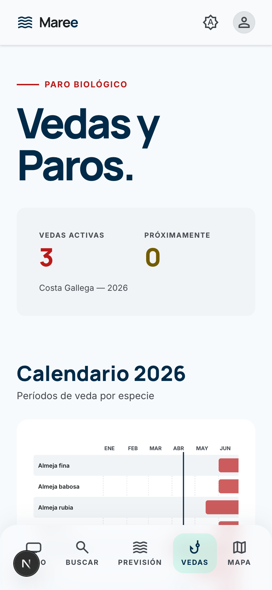
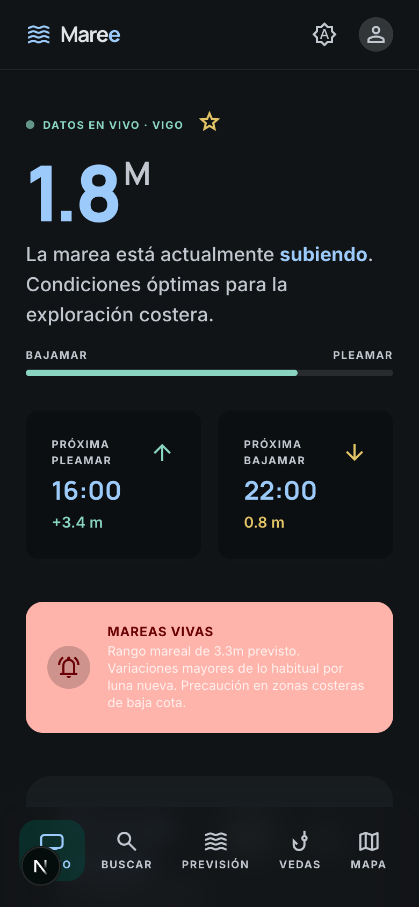

# Maree

    

Live tide data, forecasts, and coastal conditions for the Galician coast of Spain.

**[maree.vercel.app](https://maree.vercel.app/)**

Built for fishermen, coastal explorers, and ocean enthusiasts who need reliable, real-time tide information without the complexity of scientific portals.

`tides` `galicia` `oceanography` `nextjs` `pwa` `opendap` `tide-forecast` `coastal` `leaflet` `d3js` `meteogalicia` `fishing` `vedas` `marine-weather` `spain`

## Screenshots

| Home | Forecast | Map | Vedas | Dark mode |
|:---:|:---:|:---:|:---:|:---:|
|  |  |  |  |  |

## What it does

Maree pulls live tide gauge readings from Spain's national port authority and forecast models from MeteoGalicia, then presents them in a clean, mobile-first interface. Open the app, pick a station (or let GPS find the nearest one), and you immediately see:

- **Current tide height** -- whether it's rising or falling, and how far along the cycle it is
- **Next high and low tides** -- with exact times and heights
- **Interactive tide curve** -- a D3.js chart showing today's tide or a 7-day overview, with observed data overlaid on forecasts
- **Spring and neap tide alerts** -- computed from lunar phase, so you know when tidal ranges will be extreme
- **Wind, waves, and sea temperature** -- sourced from Open-Meteo
- **Sunrise and sunset** -- calculated algorithmically from station coordinates
- **Species fishing closures (Vedas)** -- an annual calendar showing which species are open or closed, with links to official Diario Oficial de Galicia publications

## Stations

Seven tide gauge stations along the Galician coast:

| Station | Location |
|---|---|
| Vigo | Ria de Vigo |
| Marin | Ria de Pontevedra |
| Vilagarcia de Arousa | Ria de Arousa |
| Langosteira | Porto Exterior |
| A Coruna | Golfo Artabro |
| Ferrol | Ria de Ferrol |
| San Cibrao | Costa da Marina |

## Data sources

| Source | What it provides |
|---|---|
| [Puertos del Estado](https://www.puertos.es) (THREDDS/OPeNDAP) | Real-time tide gauge observations |
| [MeteoGalicia](https://www.meteogalicia.gal) (MOHID/ROMS models) | 2--4 day tide forecasts per ria |
| [Open-Meteo](https://open-meteo.com) | Wind, waves, sea surface temperature |
| [DOG RSS](https://www.xunta.gal/dog) | Official fishing closure regulations |

All external requests are proxied through Next.js API routes -- the browser never calls THREDDS or OPeNDAP directly.

## Tech stack

Next.js 15 (App Router) -- React 19 -- TypeScript -- Tailwind CSS v4 -- D3.js -- Leaflet -- Vitest

Installable as a PWA with offline support. All UI text is in Spanish.

## Getting started

```bash
nvm use           # Node 22 (see .nvmrc)
npm install
npm run dev       # http://localhost:3000
```

## Scripts

| Command | Purpose |
|---|---|
| `npm run dev` | Start dev server |
| `npm run build` | Production build (includes type checking) |
| `npm run lint` | ESLint |
| `npm test` | Run all tests |
| `npm run test:watch` | Tests in watch mode |

Verification order: **lint** -> **build** -> **test**.

## Project structure

```
src/
  app/              # Pages and API routes (App Router)
    api/            # Server-side proxies to external data sources
    forecast/       # 7-day tide forecast
    map/            # Interactive Leaflet map
    search/         # Station search and favorites
    vedas/          # Species fishing closures
  components/       # React components (tide curve, cards, nav)
  lib/              # Domain logic and data fetching
    tides/          # Tide analysis, interpolation, alerts
    thredds/        # OPeNDAP parsers, caching, retry logic
    species/        # Species registry and closure calendar
```

## License

[CC BY-NC 4.0](LICENSE) -- Creative Commons Attribution-NonCommercial 4.0 International.
